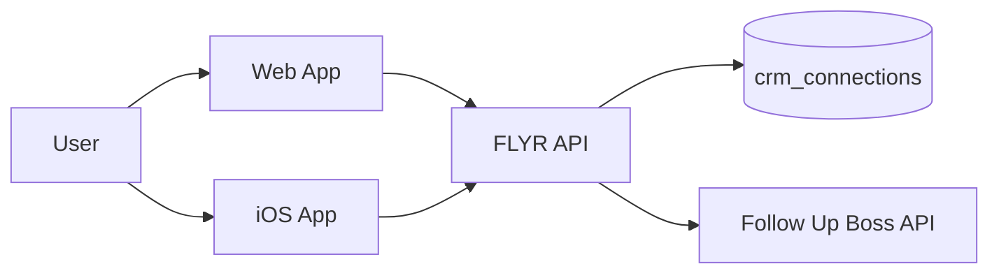

# Follow Up Boss & iOS: How FLYR Is Linked and How to Connect from the App

This guide is the single reference for how FLYR-PRO is linked to Follow Up Boss and how users can connect from the iOS app. It is written for product, support, and iOS developers.

**Recommended: Web-only connection.** Users should connect Follow Up Boss via the web app at **https://flyrpro.app/settings/integrations** (or `{APP_URL}/settings/integrations` for staging). The iOS app then uses that same connection for sync and push-lead—no native FUB token flow required.

---

## 1. High-Level Link (FLYR ↔ Follow Up Boss)

FLYR does **not** use Follow Up Boss OAuth. We use the user’s **Follow Up Boss API key**: the user enters it once (on web or in the iOS app), the FLYR backend validates it with Follow Up Boss, encrypts it, and stores it per user. After that, leads are pushed to Follow Up Boss using that stored key.

**Flow in short:**

1. User enters their Follow Up Boss API key (web or iOS).
2. FLYR backend validates the key by calling `GET https://api.followupboss.com/v1/users`.
3. Backend encrypts the key and stores it in Supabase in `crm_connections` (one row per user, provider `followupboss`).
4. When syncing or pushing leads, the backend uses the stored key to call `POST https://api.followupboss.com/v1/events`.

The iOS app never talks to Follow Up Boss directly; it always goes through the FLYR API.

---

## 2. Where the Connection Lives (Backend)

### Table: `crm_connections`

- **Migration**: [supabase/migrations/20260209163331_add_crm_connections.sql](../supabase/migrations/20260209163331_add_crm_connections.sql)
- **Columns**: `id`, `user_id` (references `auth.users`), `provider` (e.g. `'followupboss'`), `api_key_encrypted`, `status`, `created_at`, `updated_at`, `last_tested_at`, `last_push_at`, `last_error`.
- **Uniqueness**: One row per user per provider (`user_id` + `provider`).

### Row Level Security (RLS)

- Users can only read/update/delete their own row: `auth.uid() = user_id`.

### Encryption

- The Follow Up Boss API key is encrypted **server-side** with AES-256-GCM.
- The encryption key comes from the `ENCRYPTION_KEY` environment variable (see [docs/ENV-TOKENS-REFERENCE.md](ENV-TOKENS-REFERENCE.md)).
- The iOS app never sees or stores the raw Follow Up Boss API key; it only sends it once to the FLYR API when connecting.

---

## 3. FLYR API Endpoints (Contract for iOS)

Base URL: same as the web app (e.g. your deployed origin from `NEXT_PUBLIC_APP_URL`). All routes require a **valid session** (see [Connecting from the iOS app](#5-connecting-from-the-ios-app)).

| Action     | Method | Path                                          | Request body              | Success response                                      | Error response              |
| ---------- | ------ | --------------------------------------------- | ------------------------- | ----------------------------------------------------- | --------------------------- |
| Status     | GET    | `/api/integrations/followupboss/status`      | —                         | `{ connected, status, createdAt?, updatedAt?, lastTestedAt?, lastPushAt?, lastError? }` | 401 Unauthorized            |
| Connect    | POST   | `/api/integrations/followupboss/connect`      | `{ "apiKey": "string" }`  | `{ success: true, message }`                          | 400/401/500 + `{ error }`  |
| Disconnect | POST   | `/api/integrations/followupboss/disconnect`   | —                         | `{ success: true, message }`                         | 401/500 + `{ error }`      |
| Test       | POST   | `/api/integrations/followupboss/test`         | —                         | `{ success: true, message }`                         | 404/400/500 + `{ error }`  |
| Test push  | POST   | `/api/integrations/followupboss/test-push`    | —                         | `{ success: true, message }`                         | 400/500 + `{ error }`      |
| Push lead  | POST   | `/api/integrations/followupboss/push-lead`    | JSON object (see below)   | `{ success: true, message, fubEventId? }`            | 400/401/502/500 + `{ error }` |
| Sync CRM   | POST   | `/api/leads/sync-crm`                         | —                         | `{ success: true, message, synced? }`                | 401/400/500 + `{ error }`  |

### Push-lead request body

For `POST /api/integrations/followupboss/push-lead`, send a JSON object with any of these fields. At least one of `email` or `phone` is required.

| Field       | Type   | Required | Description |
| ----------- | ------ | -------- | ----------- |
| firstName   | string | No       | First name  |
| lastName    | string | No       | Last name   |
| email       | string | No*      | Email       |
| phone       | string | No*      | Phone       |
| address     | string | No       | Street      |
| city        | string | No       | City        |
| state       | string | No       | State       |
| zip         | string | No       | Zip         |
| message     | string | No       | Note/message |
| source      | string | No       | Lead source (e.g. "FLYR") |
| sourceUrl   | string | No       | Source URL  |
| campaignId  | string | No       | Campaign ID |
| metadata    | object | No       | Extra data  |

\* At least one of `email` or `phone` is required.

---

## 4. Where Users Get the Follow Up Boss API Key

Users get their API key from Follow Up Boss:

1. Log in to Follow Up Boss.
2. Go to **Admin → API**.
3. Copy the API key and paste it into FLYR at **https://flyrpro.app/settings/integrations** (web Settings → Integrations). To avoid two token stores, prefer directing users to the web integrations page rather than a native Connect screen.

Reference: [Follow Up Boss Developer API](https://developer.followupboss.com/).

Support can direct users to **Admin → API** in Follow Up Boss when they ask where to find the key.

---

## 5. Connecting from the iOS App

### Same backend, shared state

The iOS app uses the **same** FLYR API and the **same** `crm_connections` table. If a user connects on web, they are connected on iOS (and vice versa), because everything is keyed by the same `user_id`.

### Auth requirement

The server currently resolves the user from the **Supabase session in cookies** ([lib/supabase/server.ts](../lib/supabase/server.ts)). There is **no** `Authorization: Bearer` handling in the API routes today.

### Recommended: WebView / in-app browser (primary option)

**Open the web app’s Integrations page in a WebView or `SFSafariViewController`** so the user stays in the app and can sign in and enter their API key there. Use:

- **Production:** https://flyrpro.app/settings/integrations  
- **Staging:** `{APP_URL}/settings/integrations`

The session lives in the web view; after connecting, the user returns to the app and sync/push-lead use the same `crm_connections` row. **No backend change required.** Prefer this so there is a single source of truth and no duplicate token handling on iOS.

### Optional: Native “Connect Follow Up Boss” screen (deprecated)

A native screen that collects the API key and calls `POST /api/integrations/followupboss/connect` is **deprecated**. To avoid two token stores and keep one source of truth, prefer directing users to the web integrations page (https://flyrpro.app/settings/integrations). If you keep a native flow, the backend would need to accept the user’s session from the app (e.g. `Authorization: Bearer <supabase_access_token>` when cookies are missing).

### Base URL

The iOS app must call the same origin as the web app (e.g. your production URL). No extra client-side env vars are needed for Follow Up Boss; only the server uses `ENCRYPTION_KEY`, and only the server calls the Follow Up Boss API.

---

## 6. Push Lead from iOS

When the app captures a lead (e.g. at a door), it can send it to Follow Up Boss by calling:

- `POST /api/integrations/followupboss/push-lead`  
  with the same JSON shape as in the [Push-lead request body](#push-lead-request-body) table.

The server uses the stored API key and pushes the lead to Follow Up Boss via `POST https://api.followupboss.com/v1/events`.

---

## 7. Sync Existing Leads to Follow Up Boss

To sync the user’s existing leads/contacts to Follow Up Boss (when connected), call:

- `POST /api/leads/sync-crm`  
  (no body).

You can expose a “Sync to CRM” action in the iOS app that calls this endpoint.

---

## 8. Troubleshooting

| Issue | Cause | What to do |
| ----- | ------ | ---------- |
| 401 on connect: “Invalid API key…” | Follow Up Boss rejected the key | User should check the key in Follow Up Boss (**Admin → API**), ensure no extra spaces, and try again. |
| 400: “Follow Up Boss not connected” | No row in `crm_connections` for this user/provider | User must connect at **https://flyrpro.app/settings/integrations** (recommended) or via in-app browser; see [Connecting from the iOS app](#5-connecting-from-the-ios-app). |
| 401 Unauthorized on any endpoint | No valid session sent | Ensure the request includes the user’s session (cookies if using WebView, or Bearer token once the backend supports it). |
| API test fails / push fails | Key revoked or invalid | User should reconnect with a valid key from Follow Up Boss **Admin → API**. |
| App shows “no integrations” or sync fails | No FUB connection for this user | Direct the user to connect at **https://flyrpro.app/settings/integrations** (web). After connecting there, sync from the app will use the same connection. |

For more on the Follow Up Boss API: [https://developer.followupboss.com/](https://developer.followupboss.com/).

---

## 9. Related Files

- Web integrations UI: [app/(main)/settings/integrations/page.tsx](../app/(main)/settings/integrations/page.tsx)
- API routes: [app/api/integrations/followupboss/](../app/api/integrations/followupboss/) (connect, disconnect, status, test, test-push, push-lead)
- CRM sync: [app/api/leads/sync-crm/route.ts](../app/api/leads/sync-crm/route.ts)
- Server Supabase client (cookie-based session): [lib/supabase/server.ts](../lib/supabase/server.ts)
- Env/tokens (including `ENCRYPTION_KEY`): [docs/ENV-TOKENS-REFERENCE.md](ENV-TOKENS-REFERENCE.md)
