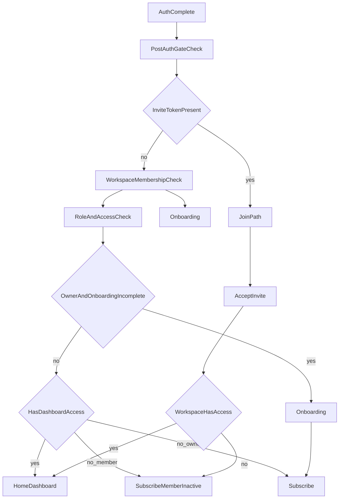

# iOS Workspace & Onboarding Implementation Guide

This guide explains how to implement workspace multitenancy and the onboarding flow in the FLYR-PRO iOS app so it matches the web app and backend behavior.

**Source of truth:** Database schema and logic live in `supabase/migrations/`; post-auth routing in `app/lib/post-auth-gate.ts`; API routes under `app/api/access/`, `app/api/onboarding/`, and `app/api/invites/`.

---

## Table of Contents

1. [Architecture Overview](#1-architecture-overview)
2. [End-to-End Flow (Auth → Onboarding → Subscribe → Dashboard)](#2-end-to-end-flow-auth--onboarding--subscribe--dashboard)
3. [API Contracts for iOS](#3-api-contracts-for-ios)
4. [Swift Data Models and Client Orchestration](#4-swift-data-models-and-client-orchestration)
5. [Team Onboarding & Invite Handling](#5-team-onboarding--invite-handling)
6. [Edge Cases & Troubleshooting](#6-edge-cases--troubleshooting)
7. [Implementation Checklist](#7-implementation-checklist)

---

## 1. Architecture Overview

### Core concepts

- **Workspace** – Multi-tenant container. Each user has at least one workspace (created automatically on signup). Data (campaigns, contacts, CRM connections) is scoped by `workspace_id`.
- **Workspace members** – Users belong to workspaces via `workspace_members` with a **role**: `owner`, `admin`, or `member`.
- **Onboarding** – Required flow for **owners** before they can access the dashboard. Sets workspace name, industry, optional brokerage, and optionally creates team invites.
- **Post-auth gate** – Server logic that decides where to send the user after login: onboarding, subscribe (paywall), or dashboard.

### Key tables

| Table | Purpose |
|------|--------|
| `workspaces` | Id, name, owner_id, subscription_status, trial_ends_at, onboarding_completed_at, industry, brokerage_id, brokerage_name, max_seats, referral_code_used |
| `workspace_members` | workspace_id, user_id, role (owner/admin/member). Unique on (workspace_id, user_id). |
| `workspace_invites` | workspace_id, email, role, token, status (pending/accepted/expired), invited_by, expires_at |
| `user_profiles` | user_id, first_name, last_name, weekly_door_goal, … |

### Access gating

- **Dashboard access** is determined by:
  - **Owner:** Must have completed onboarding (`onboarding_completed_at` set) and have an active subscription (or valid trial).
  - **Member/Admin:** Workspace must have active subscription or valid trial; no onboarding step.
- **Subscription status** – `workspaces.subscription_status`: `inactive` \| `trialing` \| `active` \| `past_due`. For “has access” the backend uses: `status === 'active'` OR (`status === 'trialing'` AND (`trial_ends_at` is null OR `trial_ends_at > now()`)).
- **Primary workspace** – For users with multiple workspaces, “primary” is the first membership by `created_at` ascending (gate and access state use this).

### New user trigger

On `auth.users` INSERT, `handle_new_user()`:

1. Inserts or ignores `user_profiles` (e.g. `weekly_door_goal = 100`).
2. If the user has **no** `workspace_members` row: creates a workspace named `"My Workspace"` with `owner_id = user.id`, then inserts `workspace_members` with `role = 'owner'`.
3. New workspaces have `onboarding_completed_at = NULL` and `subscription_status = 'inactive'` (set in later migrations). Existing workspaces were backfilled so current users skip onboarding.

---

## 2. End-to-End Flow (Auth → Onboarding → Subscribe → Dashboard)

### Flow diagram



### Owner flow (new signup)

1. User signs up → Supabase Auth → `handle_new_user()` creates workspace + owner membership.
2. iOS calls `GET /api/access/redirect` (or equivalent gate logic). Response: `redirect: 'onboarding'`, `path: '/onboarding'`.
3. Show onboarding UI (name, use case, workspace name, industry, optional brokerage, optional team invites).
4. `POST /api/onboarding/complete` with body (see API section). Response: `{ success: true, redirect: '/subscribe' }`.
5. Show subscribe/paywall. User starts checkout via `POST /api/billing/stripe/checkout`; after payment, Stripe webhook updates `workspaces.subscription_status`. iOS can poll `GET /api/access/state` until `hasAccess: true`.
6. Navigate to dashboard (e.g. home).

### Invitee flow (join via link)

1. User opens invite link: `/join?token=<token>`.
2. **Before auth:** `GET /api/invites/validate?token=<token>`. Response: `{ valid: true, workspaceName, email, role }` or 400/404.
3. If not logged in, show sign-in/sign-up. **Email used must match invite email** (case-insensitive).
4. After auth, `POST /api/invites/accept` with `{ token }`. Backend updates invite to `accepted`; DB trigger adds user to `workspace_members`. Response: `{ success: true, workspaceId, redirect: '/home' }`.
5. Check access: `GET /api/access/state`. If workspace has no active subscription, `hasAccess: false`, `reason: 'member-inactive'` → show “Contact workspace owner” / subscribe screen with member-inactive messaging. Otherwise go to dashboard.

### Where iOS should branch

- After every successful auth (or session restore), call `GET /api/access/redirect` or replicate gate logic with `GET /api/access/state` + workspace fetch.
- If `redirect === 'onboarding'` → show onboarding.
- If `redirect === 'subscribe'` → show paywall; if `path` contains `reason=member-inactive` → show member-inactive copy.
- If `redirect === 'contact-owner'` → same as subscribe with member-inactive.
- If `redirect === 'join'` → show join screen with token in URL; validate token, then sign in and accept.
- If `redirect === 'dashboard'` → go to home/dashboard.

---

## 3. API Contracts for iOS

Base URL is your app’s API (e.g. same origin as web). All authenticated endpoints require the user’s session (cookies for web; for native iOS you must send session token – see [FOLLOW_UP_BOSS_AND_IOS_GUIDE.md](FOLLOW_UP_BOSS_AND_IOS_GUIDE.md) for auth options).

### GET `/api/access/state`

Returns current user’s primary workspace role, name, and whether they have dashboard access.

**Auth:** Required.

**Response (200):**

```json
{
  "role": "owner" | "admin" | "member" | null,
  "workspaceName": string | null,
  "hasAccess": boolean,
  "reason"?: "member-inactive" | "no_workspace"
}
```

- `reason` is set when `hasAccess` is false and (for member/admin) workspace is inactive, or when there is no workspace.
- **401** – Unauthorized.
- **500** – Server error.

---

### GET `/api/access/redirect`

Returns where the user should be sent after auth (onboarding, subscribe, join, or dashboard). Uses same logic as post-auth gate.

**Auth:** Required.

**Response (200):**

```json
{
  "redirect": "login" | "join" | "onboarding" | "subscribe" | "contact-owner" | "dashboard",
  "path": string
}
```

- `path` examples: `/login`, `/onboarding`, `/subscribe`, `/subscribe?reason=member-inactive`, `/join?token=...`, `/home`.
- **401** – Treated as redirect to login (response body may still include `redirect`/`path`).

---

### POST `/api/onboarding/complete`

Completes onboarding for the current user’s **owner** workspace: updates profile, workspace, and optionally creates invites.

**Auth:** Required. User must have an owner workspace.

**Request body (all fields optional but recommended):**

```json
{
  "firstName": string,
  "lastName": string,
  "workspaceName": string,
  "industry": string,
  "referralCode": string | null,
  "useCase": "solo" | "team",
  "inviteEmails": string[],
  "brokerage": string,
  "brokerageId": string
}
```

- **industry** – Allowed values: `Real Estate`, `Logistics`, `Sales`, `Pest Control`, `HVAC`, `Insurance`, `Solar`, `Other`.
- **useCase** – If `"team"` and `inviteEmails` is a non-empty array, the backend creates `workspace_invites` rows (role `member`, 7-day expiry).
- **brokerage** – Free text; backend may match to `brokerages.id` or store as `workspace.brokerage_name`.
- **brokerageId** – UUID; if valid, stored as `workspace.brokerage_id` and `brokerage_name` cleared.

**Response (200):**

```json
{
  "success": true,
  "redirect": "/subscribe"
}
```

- **400** – e.g. “No workspace found” (user has no owner workspace).
- **401** – Unauthorized.
- **500** – “Failed to update profile” / “Failed to update workspace” / “Something went wrong”.

---

### GET `/api/invites/validate?token=<token>`

Validates an invite token. **Does not require auth.** Use before sign-in to show workspace name and invited email/role.

**Response (200):**

```json
{
  "valid": true,
  "workspaceName": string | null,
  "email": string,
  "role": "admin" | "member"
}
```

- **400** – “Token required” (missing token) or “This invite has already been used” or “This invite has expired”.
- **404** – “Invalid or expired invite”.

---

### POST `/api/invites/accept`

Accepts an invite. Current user must be authenticated; `auth.users.email` must match invite email (case-insensitive).

**Auth:** Required.

**Request body:**

```json
{
  "token": string
}
```

**Response (200):**

```json
{
  "success": true,
  "workspaceId": string,
  "redirect": "/home"
}
```

- **400** – “Token required” / “This invite has already been used” / “This invite has expired”.
- **401** – Unauthorized.
- **403** – “This invite was sent to a different email address”.
- **404** – “Invalid or expired invite”.
- **500** – “Failed to accept invite” / “Something went wrong”.

---

### POST `/api/billing/stripe/checkout`

Creates a Stripe Checkout Session for subscription. Redirects user to Stripe-hosted checkout; after payment, webhook updates `workspaces.subscription_status`. iOS typically opens the returned URL in browser or WebView.

**Auth:** Required.

**Request body:**

```json
{
  "plan": "annual" | "monthly",
  "currency": "USD" | "CAD",
  "priceId": string
}
```

- Either (`plan` + `currency`) or `priceId` (must be in allowlist).

**Response (200):**

```json
{
  "url": string
}
```

- **400** – “Valid price ID required” etc.
- **401** – Unauthorized.
- **500** – Server/Stripe error.

After successful payment, poll `GET /api/access/state` until `hasAccess === true`, then navigate to dashboard.

---

## 4. Swift Data Models and Client Orchestration

### Codable types

```swift
// MARK: - Access state (GET /api/access/state)
struct AccessStateResponse: Codable {
    let role: String?           // "owner" | "admin" | "member"
    let workspaceName: String?
    let hasAccess: Bool
    let reason: String?          // "member-inactive" | "no_workspace"
}

// MARK: - Redirect (GET /api/access/redirect)
struct AccessRedirectResponse: Codable {
    let redirect: String         // login | join | onboarding | subscribe | contact-owner | dashboard
    let path: String
}

// MARK: - Onboarding (POST /api/onboarding/complete)
struct OnboardingCompleteRequest: Codable {
    var firstName: String?
    var lastName: String?
    var workspaceName: String?
    var industry: String?
    var referralCode: String?
    var useCase: UseCase?
    var inviteEmails: [String]?
    var brokerage: String?
    var brokerageId: String?
}

enum UseCase: String, Codable {
    case solo
    case team
}

struct OnboardingCompleteResponse: Codable {
    let success: Bool
    let redirect: String?
}

// MARK: - Invites validate (GET /api/invites/validate)
struct InviteValidateResponse: Codable {
    let valid: Bool
    let workspaceName: String?
    let email: String
    let role: String             // "admin" | "member"
}

// MARK: - Invites accept (POST /api/invites/accept)
struct InviteAcceptRequest: Codable {
    let token: String
}

struct InviteAcceptResponse: Codable {
    let success: Bool
    let workspaceId: String
    let redirect: String
}
```

### Suggested app routing after sign-in

1. On launch or after auth, call `GET /api/access/redirect` (or `GET /api/access/state` and derive route).
2. Map `redirect` to a single route enum, e.g. `AppRoute.login | .onboarding | .subscribe(reason) | .join(token) | .dashboard`.
3. Present the corresponding root: login screen, onboarding flow, subscribe/paywall (with optional `reason == "member-inactive"`), join flow with token, or main tab (e.g. home).
4. After onboarding completion, navigate to subscribe; after subscribe success (and `hasAccess == true`), navigate to dashboard.
5. For invite link: validate token first, then if not authenticated go to login preserving token; after login call accept, then check access and go to dashboard or member-inactive subscribe.

---

## 5. Team Onboarding & Invite Handling

### Token validation

- Always validate with `GET /api/invites/validate?token=...` before showing sign-up/sign-in for an invite. If invalid/expired/used, show error and do not prompt for sign-in with that token.
- Display `workspaceName` and `email` so the user knows which workspace and that they must sign in with that email.

### Email match

- Invite acceptance requires `lower(trim(auth.users.email)) == lower(trim(invite.email))`. If the user signs in with a different email, `POST /api/invites/accept` returns **403** “This invite was sent to a different email address”. iOS should show a clear message and optionally offer to sign out or use the correct email.

### Expiry and status

- Invites expire 7 days after creation (`expires_at`). If `expires_at <= now()` or status is not `pending`, validate returns 400 and accept returns 400/404. Show “This invite has expired” and do not allow accept.

### Invite link handling

- Universal link or custom URL: extract `token` from query (e.g. `yourapp://join?token=...` or path equivalent). Store token, then:
  - If unauthenticated: show validate result (workspace name, email), then sign-in/sign-up; after auth call accept.
  - If authenticated: if email matches, call accept; else show 403 message.

---

## 6. Edge Cases & Troubleshooting

### Multi-workspace users

- Gate and `GET /api/access/state` use the **first** membership by `created_at` as primary. If the user has multiple workspaces, iOS may later add a workspace switcher and pass `workspaceId` to APIs that support it; for onboarding and access gate, primary is sufficient.

### Member / admin and inactive workspace

- When the workspace has no active subscription (or trial expired), members and admins get `hasAccess: false` and `reason: 'member-inactive'`. Show a “Contact your workspace owner to activate the subscription” (or similar) screen; do not offer checkout for the member (subscription is owned by the workspace owner).

### Trial expiration

- Backend treats trialing as active only when `trial_ends_at` is null or `trial_ends_at > now()`. After trial ends, `hasAccess` becomes false until the owner pays. Avoid caching access state for long; re-check after app foreground or before critical actions.

### Primary workspace and “no workspace”

- If `workspace_members` is empty (e.g. trigger failed or edge case), gate returns onboarding and access/state returns `role: null`, `hasAccess: false`, `reason: 'no_workspace'`. iOS should show onboarding; completing it requires an owner workspace, so normally the trigger ensures one exists for new signups.

### Dual entitlement systems

- Dashboard access is gated by `workspaces.subscription_status` (and trial). There is also an `entitlements` table used for billing/customer id; do not use `entitlements` alone to decide dashboard access. Always use `GET /api/access/state` or equivalent workspace + subscription checks.

### Common API errors

| HTTP | Body / situation | Action |
|------|-------------------|--------|
| 400  | No workspace found | User has no owner workspace; show onboarding or support. |
| 400  | Token required / invite already used / expired | Show message; do not retry accept. |
| 401  | Unauthorized | Re-authenticate; redirect to login. |
| 403  | Invite sent to different email | Show “Sign in with the email this invite was sent to.” |
| 404  | Invalid or expired invite | Show “Invalid or expired invite.” |
| 500  | Various | Retry once; show generic error. |

---

## 7. Implementation Checklist

Use this order so onboarding and workspace behavior match the backend.

- [ ] **Auth & session** – Supabase Auth on iOS; persist session; send session to API (see [FOLLOW_UP_BOSS_AND_IOS_GUIDE.md](FOLLOW_UP_BOSS_AND_IOS_GUIDE.md) for cookie vs Bearer).
- [ ] **Post-auth gate** – After login (or session restore), call `GET /api/access/redirect` and route to login / onboarding / subscribe / join / dashboard.
- [ ] **Onboarding UI** – Multi-step: name, use case (solo/team), workspace name, industry, optional brokerage, optional invite emails; validate required fields.
- [ ] **Onboarding API** – `POST /api/onboarding/complete` with correct body; handle 400/401/500; on success go to subscribe.
- [ ] **Subscribe / paywall** – Show plans; call `POST /api/billing/stripe/checkout` and open URL; after return, poll `GET /api/access/state` until `hasAccess: true` then go to dashboard.
- [ ] **Access state** – Use `GET /api/access/state` for guards and to show member-inactive when `reason == "member-inactive"`.
- [ ] **Invite link** – Handle URL with token; `GET /api/invites/validate`; show workspace + email; sign-in/sign-up with matching email; `POST /api/invites/accept`; then gate by access state.
- [ ] **Workspace context** – Store current workspace id (e.g. from invite accept response or workspace list); pass to APIs that accept `workspaceId` for scoped data. Campaigns and map data (see [IOS_IMPLEMENTATION_GUIDE.md](IOS_IMPLEMENTATION_GUIDE.md)) are workspace-scoped: each campaign has a `workspace_id`; use the current workspace when fetching campaigns and building data.
- [ ] **Error handling** – Map 400/401/403/404/500 to user-facing messages; handle invite email mismatch and expired tokens explicitly.
- [ ] **Testing** – New owner flow (signup → onboarding → subscribe → dashboard); invite flow (validate → sign in with same email → accept → dashboard or member-inactive); member-inactive and trial expiry behavior.

---

## Related documentation

- [FOLLOW_UP_BOSS_AND_IOS_GUIDE.md](FOLLOW_UP_BOSS_AND_IOS_GUIDE.md) – Auth and API usage from iOS (WebView vs native, session).
- [IOS_IMPLEMENTATION_GUIDE.md](IOS_IMPLEMENTATION_GUIDE.md) – Building/map data and GERS ID.
- [IOS_QUICK_REFERENCE.md](IOS_QUICK_REFERENCE.md) – Query reference.
- Backend: `app/lib/post-auth-gate.ts`, `app/api/onboarding/complete/route.ts`, `app/api/invites/validate/route.ts`, `app/api/invites/accept/route.ts`, `app/api/access/state/route.ts`, `app/api/access/redirect/route.ts`.
- Schema: `supabase/migrations/20260218220000_workspace_multitenancy_phase1.sql`, `20260218235000_workspace_subscription_and_onboarding.sql`, `20260218236000_workspace_invites.sql`.
