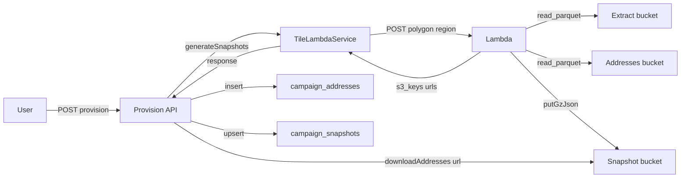
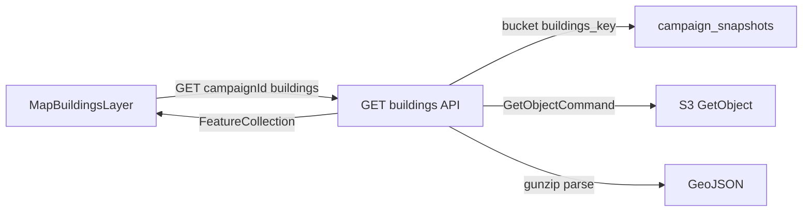

# FLYR-PRO: Recent Work (Last 4 Days) and S3 / Snapshot Guide

This document summarizes the last four days of work on FLYR-PRO and provides a detailed guide on how we use AWS S3: which buckets we call, how addresses and buildings are obtained and stored, and how the campaign snapshot is stored and retrieved.

---

## 1. Summary of Last 4 Days

### 1.1 Home dashboard

- New home experience: [app/(main)/home/page.tsx](../app/(main)/home/page.tsx), [components/home/HomeDashboardView.tsx](../components/home/HomeDashboardView.tsx)
- [GET /api/home/dashboard](../app/api/home/dashboard/route.ts): user stats, weekly goals, recent campaigns, last session
- Weekly goals on `user_profiles`: `weekly_door_goal`, `weekly_sessions_goal`, `weekly_minutes_goal`
- Daily quote/riddle cache: table `daily_content_cache`, [GET /api/daily-content](../app/api/daily-content/route.ts)
- Widgets: weather, quote card, weekly goals card, stats overview, recent campaigns (TodayPanel, WeatherWidget, DailyQuote, QuoteCard, WeeklyGoalsCard, StatsOverviewCard, RecentSnapshot)

### 1.2 Campaigns and routing

- Campaigns under main app: [app/(main)/campaigns/](../app/(main)/campaigns/) (list + detail), [CampaignListSidebar](../components/campaigns/CampaignListSidebar.tsx)
- Route optimization (Street-Block-Sweep-Snake only): [OptimizedRouteView](../components/campaigns/OptimizedRouteView.tsx), [app/api/campaigns/[campaignId]/routes/optimize/](../app/api/campaigns/[campaignId]/routes/optimize/route.ts), BlockRoutingService.buildRoute, RoutingService.getRouteGeometry (optional polyline when STADIA_API_KEY set)
- Walk network snapping: RPCs `snap_point_to_walkway`, `snap_points_to_walkways`, `find_nearest_walkway_segment`; column `overture_transportation.subclass` (sidewalk, crosswalk)
- Route persistence: view `campaign_addresses_geojson` exposes `cluster_id`, `sequence`, `walk_time_sec`, `distance_m` so optimized routes survive reload
- Map: RouteLayer, CampaignMarkersLayer, MapInfoButton, MapInfoSheet

### 1.3 CRM and integrations

- Table `crm_connections`: provider, encrypted API key, status, last tested/push/error (RLS per user)
- FollowUpBoss: [app/api/integrations/followupboss/](../app/api/integrations/followupboss/) (connect, disconnect, status, test, test-push, push-lead). For how we're linked to Follow Up Boss and how to connect from the iOS app, see [docs/FOLLOW_UP_BOSS_AND_IOS_GUIDE.md](../docs/FOLLOW_UP_BOSS_AND_IOS_GUIDE.md).
- Leads page: [app/(main)/leads/](../app/(main)/leads/) using ContactsHubView
- [app/api/leads/sync-crm/](../app/api/leads/sync-crm/route.ts) for CRM sync

### 1.4 Campaign building/address tooling

- RPC `get_nearby_unlinked_addresses`: find addresses near a building for manual assignment
- Campaign APIs: buildings ([campaignId]/buildings, [buildingId]/addresses, nearby-addresses), units, matches, orphans (assign), split-errors (resolve)
- Manual linking flows and campaign detail map view updates

### 1.5 Farms

- New section: [app/(main)/farms/](../app/(main)/farms/) (layout + page), FarmListView on home

### 1.6 Migrations (Feb 9–10)

| Migration | Purpose |
|-----------|--------|
| `20260209163331_add_crm_connections.sql` | CRM connections table + RLS |
| `20260209180600_add_nearby_unlinked_addresses_rpc.sql` | RPC for nearby unlinked addresses |
| `20260209190000_add_daily_content_cache.sql` | Daily quote/riddle cache + get functions |
| `20260210000000_add_weekly_goals_to_user_profiles.sql` | Weekly goals on user_profiles |
| `20260210000001_snap_point_to_walkway_rpc.sql` | Snap point(s) to walkway |
| `20260210000002_overture_transportation_subclass.sql` | subclass on overture_transportation |
| `20260210000003_update_walkway_snap_rpc.sql` | Walkway snap RPC update |
| `20260210000004_find_nearest_walkway_segment_rpc.sql` | Nearest walkway segment for block ordering |
| `20260210000004_campaign_addresses_geojson_route_columns.sql` | CVRP route columns on campaign_addresses_geojson view |

---

## 2. S3 and Snapshot: How We Call the Bucket, Get Addresses/Buildings, Store and Call the Snapshot

This section is the operational guide: which buckets are used, how data is obtained, stored, and read.

### 2.1 Buckets and roles

**Extract / data-lake bucket** (e.g. `flyr-pro-addresses-2025`, env `EXTRACT_BUCKET` / `ADDRESSES_BUCKET` in Lambda):

- **Addresses**:
  - **US states**: Parquet at `master_addresses_parquet/state={state}/data_*.parquet`
  - **Canadian provinces**: CSV at `silver/ca/{province}/addresses.csv` (StatCan ODA data)
  - See [kimi-cli/templates/lambda/index.js](../kimi-cli/templates/lambda/index.js): `addressesPathForState`, `ADDRESSES_BUCKET`.
- **Buildings/roads**: Thematic tiles under `overture_extracts` (or `EXTRACT_PREFIX`): e.g. `.../theme=buildings/...`, `.../theme=transportation/...` keyed by `OVERTURE_RELEASE` and region/tile.

**Snapshot bucket** (e.g. `flyr-snapshots`, env `SNAPSHOT_BUCKET` in Lambda):

- Campaign-specific outputs: `campaigns/{campaignId}/buildings.geojson.gz`, `addresses.geojson.gz`, `roads.geojson.gz`, `metadata.json.gz`.
- Written by Lambda; intended 30-day TTL; read by Next.js API (and optionally clients via presigned URLs).

### 2.2 Where addresses and buildings come from (Lambda)

- **Flow**: Provision (or generate-address-list) sends polygon + region to the **Tile Lambda** (Lambda function URL, auth header `x-slice-secret`).
- **Lambda** ([kimi-cli/templates/lambda/index.js](../kimi-cli/templates/lambda/index.js)):
  - **Buildings**: Reads from the extract bucket (tiled parquet by theme `buildings`). `queryTheme("buildings", polygon, limit, regionCode)` uses DuckDB `read_parquet` + `ST_Intersects` on the polygon.
  - **Addresses**: Reads from the addresses bucket. `queryAddresses({ state, polygon, limit })` uses:
    - **US states**: DuckDB `read_parquet()` on `master_addresses_parquet/state={state}/*`
    - **Canadian provinces**: DuckDB `read_csv_auto()` on `silver/ca/{province}/addresses.csv` (StatCan ODA)
    - Both use bbox + `ST_Intersects` for spatial filtering.
  - **Roads** (optional): Same pattern, theme `roads`.
- **Output**: Lambda writes GeoJSON (gzipped) to the **snapshot bucket** via `putGzJson` (AWS `PutObjectCommand`). Key pattern: `campaigns/{campaignId}/buildings.geojson.gz`, etc. It returns a JSON body with `bucket`, `prefix`, `counts`, `s3_keys` (buildings, addresses, roads, metadata), and presigned `urls` (default 1h TTL).

### 2.3 How the Next.js app calls Lambda and S3 (provision)

**Provision** ([app/api/campaigns/provision/route.ts](../app/api/campaigns/provision/route.ts)):

1. Loads campaign (`territory_boundary`, `region`).
2. Calls [TileLambdaService.generateSnapshots()](../lib/services/TileLambdaService.ts): POST to `SLICE_LAMBDA_URL` with polygon, region, campaign_id, limits.
3. Receives Lambda response: `bucket`, `prefix`, `counts`, `s3_keys`, `urls`, `metadata` (e.g. `tile_metrics`, `overture_release`).
4. **Addresses only** are pulled into Supabase: `TileLambdaService.downloadAddresses(snapshot.urls.addresses)` (fetch presigned URL), then `convertToCampaignAddresses` → insert into `campaign_addresses`.
5. **Snapshot metadata** is stored in Supabase: upsert into `campaign_snapshots` with `bucket`, `prefix`, `buildings_key`, `addresses_key`, `roads_key`, `metadata_key`, `*_url`, `*_count`, `overture_release`, `tile_metrics`, `expires_at` (30 days).
6. Buildings and roads remain in S3; no building GeoJSON is stored in Supabase.

### 2.4 Storing the snapshot (Supabase)

- **Table**: `campaign_snapshots` ([supabase/migrations/20251216000000_add_campaign_snapshot_columns.sql](../supabase/migrations/20251216000000_add_campaign_snapshot_columns.sql)). One row per campaign (`unique_campaign_snapshot`).
- **Key columns**: `campaign_id`, `bucket`, `prefix`, `buildings_key`, `addresses_key`, `roads_key`, `metadata_key`, presigned `*_url` (optional, may expire), `buildings_count`, `addresses_count`, `roads_count`, `overture_release`, `tile_metrics`, `optimized_path_*`, `expires_at`.
- **Purpose**: Persist S3 location and counts so the app can fetch buildings (and optionally roads) using stable bucket/key instead of expiring presigned URLs.

### 2.5 Calling the snapshot (reading buildings and addresses)

**Buildings (web map)**:

- **Endpoint**: `GET /api/campaigns/[campaignId]/buildings` ([app/api/campaigns/[campaignId]/buildings/route.ts](../app/api/campaigns/[campaignId]/buildings/route.ts)).
- **Logic**: Read `campaign_snapshots` for `campaign_id` → get `bucket`, `buildings_key`. Call AWS SDK `GetObjectCommand` (S3Client with `AWS_REGION`, `AWS_ACCESS_KEY_ID`, `AWS_SECRET_ACCESS_KEY`), then `gunzipSync` + JSON parse → return GeoJSON FeatureCollection. This avoids expired presigned URLs.
- **Consumer**: [MapBuildingsLayer](../components/map/MapBuildingsLayer.tsx) fetches `GET /api/campaigns/${campaignId}/buildings`, merges with Supabase `building_units` (units for multi-unit, parent building from S3 for detached), then renders on the map.

**Addresses**:

- After provision, addresses live in Supabase `campaign_addresses`. There is no S3 read at request time for the address list.
- The generate-address-list flow uses Lambda snapshot URLs only to **download once** and then insert into `campaign_addresses`.

### 2.6 Data flow (Mermaid)

**Provision flow**

**Read buildings flow**

### 2.7 Gold tier: Toronto (and municipal) address claw into S3

- **Script**: [scripts/ingest_municipal_data.ts](../scripts/ingest_municipal_data.ts) (“the claw”) fetches from ArcGIS REST or Toronto CKAN Open Data, normalizes, and uploads GeoJSON to the **extract bucket** (e.g. `flyr-pro-addresses-2025`) under `gold-standard/...`.
- **Toronto (two sources, same S3 key)**:
  - **`toronto_addresses_ckan`** (recommended): Toronto Open Data CKAN API. Package [address-points-municipal-toronto-one-address-repository](https://ckan0.cf.opendata.inter.prod-toronto.ca/dataset/address-points-municipal-toronto-one-address-repository), datastore_search with limit/offset; same schema (ADDRESS_NUMBER, LINEAR_NAME_FULL, geometry). No ArcGIS version drift.
  - **`toronto_addresses`**: ArcGIS Layer 101 at `https://gis.toronto.ca/arcgis/rest/services/cot_geospatial27/FeatureServer/101` (if 404, check [services index](https://gis.toronto.ca/arcgis/rest/services/?f=json) for e.g. `cot_geospatial28`).
- Output for both: `gold-standard/canada/ontario/toronto/addresses.geojson`.
- **Tables**: Before running the claw (and before loading that GeoJSON into the DB), ensure **Supabase migrations are applied** so `ref_addresses_gold` exists. Use `--check-db` to verify (requires `DATABASE_URL` in `.env.local`).
- **Run**:
  1. `supabase db push` (or apply migrations).
  2. `npx tsx scripts/ingest_municipal_data.ts --source=toronto_addresses_ckan --check-db` (CKAN) or `--source=toronto_addresses --check-db` (ArcGIS).
  3. Optionally load from S3 into `ref_addresses_gold` via [scripts/load_gold_direct.ts](../scripts/load_gold_direct.ts) (expects `street_number`, `street_name`, `city` in GeoJSON properties).

---

## 3. Environment and configuration

**Lambda**

- `SNAPSHOT_BUCKET`, `SNAPSHOT_PREFIX` (e.g. `campaigns`), `EXTRACT_BUCKET`, `ADDRESSES_BUCKET`, `OVERTURE_RELEASE`, `AWS_REGION`. Optional: `MAX_TILES_PER_REQUEST`, etc.

**Next.js (provision + buildings route)**

- `SLICE_LAMBDA_URL`, `SLICE_SHARED_SECRET` (for calling Lambda in provision).
- `AWS_REGION`, `AWS_ACCESS_KEY_ID`, `AWS_SECRET_ACCESS_KEY` (for S3 GetObject in the buildings API route).

---

## 4. File references (quick index)

| Area | Files |
|------|--------|
| S3 / Lambda | [lib/services/TileLambdaService.ts](../lib/services/TileLambdaService.ts), [app/api/campaigns/provision/route.ts](../app/api/campaigns/provision/route.ts), [app/api/campaigns/[campaignId]/buildings/route.ts](../app/api/campaigns/[campaignId]/buildings/route.ts), [kimi-cli/templates/lambda/index.js](../kimi-cli/templates/lambda/index.js) |
| Snapshot schema | [supabase/migrations/20251216000000_add_campaign_snapshot_columns.sql](../supabase/migrations/20251216000000_add_campaign_snapshot_columns.sql) |
| Map consumption | [components/map/MapBuildingsLayer.tsx](../components/map/MapBuildingsLayer.tsx) (fetchCampaignData, merge units + S3 buildings) |
